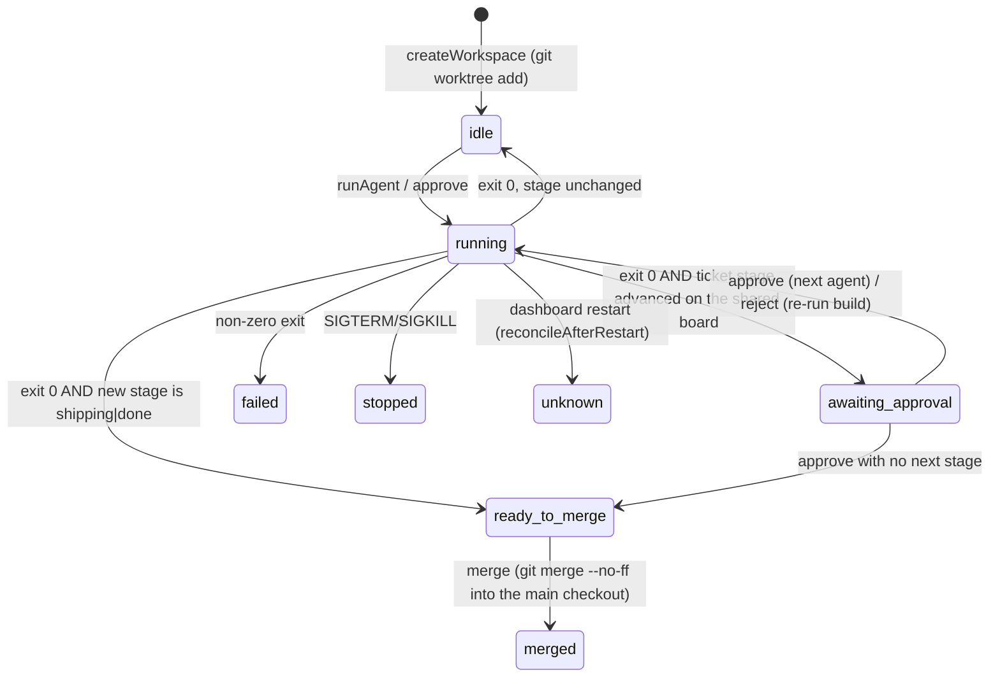

# Architecture

_Generated by bobby-arch. Re-run: `bobby run arch`_

**Read this if you are about to change the orchestrator, the dashboard server, the
worktree layer, or anything that decides which agent runs next.** It records the data
flow and the invariants — the places where being wrong breaks something quietly.

## Overview

Bobby is a CLI plus a local web app that runs a team of AI coding agents through a
ticket workflow for a solo developer. `bobbycode` is the MIT npm package: the CLI
(`bin/bobby.js`), the ticket/workflow engine (`lib/`), the agent prompt builders, the
scaffolding templates, and the whole local HTTP API. It has no runtime service, no
database, and no network dependency — everything is files on disk plus child processes.

Two consumers drive the same engine: the CLI (a human at a terminal) and the local
server (`bobby app`, and `bobby remote` for a phone). Both build the same prompts and
both spawn the same `claude` subprocess.

## Domain Glossary

**Ticket** — a directory `.bobby/tickets/TKT-NNN--slug/` containing `ticket.md`
(YAML frontmatter + markdown body), usually `plan.md` and `test-cases.md`. The
frontmatter *is* the database; there is no other store.

**Stage** — where a ticket is in its life: `backlog → planning → building → reviewing →
testing → shipping → done`, plus `blocked` and the four design stages
(`design-research`, `design-analyze`, `design-mockup`, `design-spec`). Defined in
`lib/stages.js`. Stage lives in `ticket.md` frontmatter and nowhere else.

**Transition alias** — the short word a human types: `plan`, `build`, `review`, `test`,
`ship`, plus the three specials `reject` / `block` / `unblock` handled outside the
table (`lib/stages.js` `TRANSITIONS`, `lib/dashboard/actions.js` `moveWithAlias`).

**Workflow** (internally sometimes "pipeline") — the ordered stage list a ticket runs
through. Built-ins `default`, `secure`, `quick`, `design` in `lib/workflow.js`; users
add or override under `workflows:` in `.bobbyrc.yml`. Resolution precedence: explicit
`--workflow` > ticket frontmatter `workflow:` > named workflow > `DEFAULT_WORKFLOW`.

**Agent** — an entry in `AGENT_REGISTRY` (`lib/agent-registry.js`). Flags on the entry
decide dispatch: `requiresTicket`, `cowork` (works with or without a ticket),
`freeform` (never needs a ticket), `custom` (has a bespoke builder in `workflow.js`).
A ticket-less agent that operates on the repo is what TKT-014 calls a *repo run*.

**Epic / feature** — a ticket with `type: epic`; children point at it via `parent:`.
`bobby run feature` plans and builds all children on one branch.

**Workspace** — the app's unit of work: one ticket, one git worktree, one branch, a
status, and a run history. Record shape in `lib/dashboard/state.js`; persisted to
`.bobby/workspaces.json`.

**Run** — one execution of one agent inside a workspace. Appended to `workspace.runs`.
There is no `/api/runs` yet (that is TKT-017).

**Checkpoint** — a commit the orchestrator makes in the worktree after every run so the
diff viewer always shows committed state (`commitCheckpoint`).

**Session** — a JSONL log at `.bobby/sessions/ses-<timestamp>.jsonl`. Every executor
event is mirrored into it; the server tails it into SSE.

**Studio** — the machine-wide project registry at `~/.bobby/projects.yml`
(`lib/studio.js`). Any command run inside a project upserts it. (On the newer
`feat/workspace-projects` branch this word is reused for a different concept — see
"Branch topology".)

**Target** — the AI harness the scaffold is written for (`claude-code`, `cursor`,
`cline`), deciding where agents/skills/commands files land (`lib/targets/`).

**Executor** — the CLI the server spawns (`claude` or `cursor-agent`), a separate axis
from target (`lib/dashboard/executor.js`).

**Overlay** — `X.ext` is Bobby's and is regenerated on upgrade; `X.local.ext` is yours,
seeded once and never rewritten. Pinned by `test/lib/overlay.test.js`.

## Repositories & Tech Stack

| Repo | Purpose | Stack |
|---|---|---|
| `bobbycode` (this repo, MIT) | CLI, ticket engine, workflow/prompt builders, orchestrator, HTTP API, scaffolding templates, classic dashboard UI | Node ≥18, ESM only (`"type": "module"`). `commander`, `gray-matter`, `yaml`, `inquirer`, `chalk`, `ejs`, `ws`, `qrcode-terminal`. No framework, no bundler, no DB |
| `@bobbycode/pro-dashboard` (private, paid) at `/Users/ccevans/Desktop/bobbycode-pro/app/` | **The Bobby App UI.** `app/` is the App (index.html, app.js, style.css, `lib/{store,transport,ui}.js`, `views/{home,board,feature,workspace}.js`); `ui/` is a separate add-on for the classic dashboard; `index.js` exports `register(context)` | Dependency-free browser ES modules |
| Bobby HQ (phone client) + relay | Talk to `bobby remote` over the encrypted channel | Out of this repo |

### The App-UI seam — read this before touching the UI

**The app UI is not in this repository.** `commands/app.js` `resolveAppDir()` picks the
directory served at `/`, in this order:

1. `BOBBY_APP_DIR` — an explicit path (how the App is developed). If it has no
   `index.html`, it falls back to classic and says so.
2. Pro active + `@bobbycode/pro-dashboard` found → `<pkg>/app/`. Discovery order for
   the package: `$BOBBY_PRO_DASHBOARD` → `~/.bobby/pro/node_modules/` →
   `<project>/node_modules/` (`lib/dashboard/plugins.js`).
3. Otherwise `null` → the free classic dashboard in `templates/dashboard/`.

When an app dir is active, the classic UI is still mounted at `/classic/`. **The API the
App consumes is entirely in this repo** (`lib/dashboard/server.js`) and is MIT. If you
are asked to "change the app", decide first whether the change is API (here) or view
(the Pro repo). Its visual contract is `.bobby/design/design-spec-feature-view.md` —
read that file, do not restate it.

## Request Flow

```
CLI:   bobby go ─▶ buildBrief() ─▶ nextAction.argv ─▶ re-invokes `bobby run …`
       bobby run <agent> [ids] ─▶ resolveWorkflow ─▶ buildPromptFor ─▶ PRINTS the prompt
                                                     (the CLI never spawns claude)

App:   browser ─▶ http://127.0.0.1:7777
         static  ─▶ appDir (Pro/BOBBY_APP_DIR) or templates/dashboard, /classic/ alias
         /api/*  ─▶ lib/dashboard/server.js
                     ├─ reads/writes tickets ─▶ lib/tickets.js ─▶ .bobby/tickets/*/ticket.md
                     ├─ POST /api/go ─▶ actions.executeGoAction ─▶ orchestrator
                     └─ workspace verbs ─▶ Orchestrator
                          createWorkspace ─▶ worktree.createWorktree (git worktree add)
                          runAgent        ─▶ buildPromptFor ─▶ executor.runAgent
                                             spawn `claude -p <prompt>
                                                    --output-format stream-json --verbose`
                                             cwd = the worktree
                          each stdout line ─▶ session JSONL + SSEHub.broadcast
                          on exit          ─▶ re-read ticket stage FROM THE SHARED BOARD
                                             commitCheckpoint, set status, maybe auto-approve
         /api/events, /api/workspaces/:id/events ─▶ SSE (lib/dashboard/sse.js)

Phone: bobby remote ─▶ same server on 127.0.0.1:<ephemeral>
                    ─▶ ONE outbound WebSocket to the relay
                       RemoteTunnel proxies decrypted {req,sub} frames into /api/*
```

There is no database. State lives in: `.bobby/tickets/**/ticket.md` (frontmatter),
`.bobby/workspaces.json`, `.bobby/sessions/*.jsonl`, `.bobbyrc.yml`, and git itself.

## State Machines

### Workspace (`lib/dashboard/state.js`, driven by `lib/dashboard/orchestrator.js`)



The transition rule lives in `_onExit`: **exit code 0 alone is not success.** Success is
`exitCode === 0` *and* the ticket's stage on the shared board differing from
`workspace.stage`. A clean exit with no stage change lands back in `idle`, not
`awaiting_approval` — which is what an agent that silently did nothing looks like.

### Ticket

`backlog → planning → building → reviewing → testing → shipping → done`, with `blocked`
recording `previous_stage` for `unblock`. `moveTicket` also **auto-advances the parent
epic** when every non-blocked child has reached a later stage (`lib/tickets.js`, end of
`moveTicket`) — a change to one child can rewrite the epic's frontmatter.

## Key Patterns

- **Add an agent = add a registry entry.** `AGENT_REGISTRY` with `promptHeader` +
  `promptSteps` is enough; `buildPromptFor` and `run.js` dispatch generically. Only
  `ship`, `workflow`, `feature`, `next` have bespoke builders.
- **`buildPromptFor(agent, ticketIds, ctx)` is the one prompt door.** The CLI and the
  orchestrator both go through it, so they can never disagree about what an agent is
  told. Anything that builds a prompt elsewhere is a bug waiting to happen.
- **`executeGoAction(argv, ctx)` is the one action door.** `brief.nextAction.argv` is
  machine-readable; the CLI executes it by re-invoking itself, the server maps the same
  argv onto the orchestrator. Same reason.
- **`route(method, pattern, handler)`** in `server.js` is a hand-rolled matcher —
  `:param` becomes `([^/]+)`. Routes are matched in registration order and core routes
  are registered before extensions. Extension routes are forced to start with
  `/api/pro/`.
- **Nothing in the server throws to the client.** Handlers wrap in try/catch and return
  `{ error, details }`. Logging and SSE writes are wrapped so they can never crash a run.
- **The classic UI is dependency-free ES modules** served straight from
  `templates/dashboard/`, with mtime cache-busting injected into the HTML at serve time.
- **Overlay everywhere.** Wherever you read `X.ext`, also read `X.local.ext` and let it
  win. `isUserOwned` in `lib/template.js` decides what upgrade may overwrite.

## Data / Storage

| Path | What |
|---|---|
| `.bobbyrc.yml` | project config; `readConfig` merges over `DEFAULTS`, deep-merging `git_conventions` and `dashboard` |
| `.bobby/tickets/TKT-NNN--slug/` | `ticket.md` (frontmatter = the record), `plan.md`, `test-cases.md` |
| `.bobby/tickets/.counter` | last claimed number. IDs are claimed by `fs.mkdirSync` — EEXIST means another agent won the race, retry the next number (`lib/counter.js`). **Never write this file by hand.** |
| `.bobby/workspaces.json` | workspace store; tmp-file + rename so a crash mid-write leaves the old state intact |
| `.bobby/sessions/*.jsonl` | append-only run logs, tailed into SSE |
| `~/.bobby/projects.yml` | machine-wide project registry |
| `~/.bobby/licenses.yml` | Pro key (ed25519, verified offline) |
| `~/.bobby/pro/node_modules/` | where `bobby pro install` puts paid packages |
| `~/.bobby/remote/<sha256(repoRoot)[:16]>.yml` | remote pairing, mode 0600, **never in the repo** |

No migrations. Schema changes are frontmatter changes; `readConfig` defaults and
tolerant readers are the compatibility layer.

## Remote (`lib/remote/`)

- `crypto.js` — AES-256-GCM per frame, fresh 12-byte nonce, `nonce|tag|ciphertext`
  base64url. The 256-bit key travels to the phone *inside the pairing code* (QR or
  paste), never through the relay. No handshake, no accounts, nothing server-side.
- `tunnel.js` — one outbound WebSocket; nothing listens on the network. The phone may
  reach **only** `/^\/api\/[A-Za-z0-9/_.-]*$/` with **only** GET or POST. Frame verbs:
  `req` / `sub` / `unsub` in, `res` / `ev` / `end` / `hi` out. A frame that fails
  decryption is dropped in silence.
- `pairing-store.js` — one channel **per project root** (the filename is a hash of the
  resolved root), not per machine. `--new-code` rotates and cuts old phones off.

## Testing Approach

- `npm test` → `NODE_OPTIONS='--experimental-vm-modules' jest`. `npm run lint` → eslint.
  CI runs lint then test on Node 18/20/22 (`.github/workflows/ci.yml`).
- `jest.config.js` sets `roots: ['<rootDir>/test']` deliberately — starter templates
  under `templates/starters/**` carry `node:test` files that must not be discovered.
- `test/setup.js` sets `BOBBY_NO_REGISTRY=1` (so tests never touch the real
  `~/.bobby/projects.yml`) and a git identity (so worktree/commit tests pass on a bare
  runner). Studio tests override `HOME` instead.
- Style: real temp dirs (`fs.mkdtempSync`) and real `git`, not mocks. `test/e2e/`
  shells out to `bin/bobby.js` against a scaffolded project.
- `runAgent` takes a `spawn` override so executor tests never launch a real CLI.
  `Orchestrator` methods that need no I/O are tested by constructing a bare prototype
  (`test/lib/dashboard/orchestrator-pipeline.test.js`) — do the same rather than
  building a full orchestrator.
- No Docker. No browser suite yet — committing one is TKT-016.

## Critical Files

| File | Why it matters |
|---|---|
| `lib/dashboard/orchestrator.js` | workspace lifecycle, the FSM, stage detection, approve/reject/merge/discard |
| `lib/dashboard/worktree.js` | every git operation; `mergeToMain` is the one thing that mutates the main checkout |
| `lib/dashboard/executor.js` | argv per CLI flavour, stream-json line parsing, SIGTERM→SIGKILL |
| `lib/dashboard/server.js` | ~31 routes, static serving, the extension seam, SSE wiring |
| `lib/dashboard/state.js` | workspace shape, statuses, atomic persistence, restart reconciliation |
| `lib/dashboard/actions.js` | the server-side twin of `bobby go` |
| `lib/workflow.js` | workflow resolution + **every** prompt builder (`buildPromptFor`) |
| `lib/agent-registry.js` | the list of agents and their dispatch flags |
| `lib/tickets.js` | ticket CRUD, stage moves, epic auto-advance |
| `lib/config.js` | `readConfig`, `findProjectRoot`, `findMainWorktreeRoot`, `resolveTicketsDir` |
| `lib/brief.js` | "where was I" + `nextAction` — the brain behind `bobby go` and `/api/go` |
| `commands/app.js` | server wiring and the App-UI seam |
| `lib/remote/tunnel.js` | the phone trust boundary |
| `.bobby/design/design-spec-feature-view.md` | the App's visual contract (light-only) |

## Common Pitfalls

1. **Tickets are shared state; only CODE is isolated per worktree.** `resolveTicketsDir`
   sends every CLI write to the **main checkout**, and since TKT-051 the orchestrator
   reads there too — prompt building, the existence check, feature children, and the
   stage re-read on exit all go through `this.ticketsDir`. A worktree's own
   `.bobby/tickets` is a checkout frozen at fork time; nothing may read it. It used to,
   which is why a ticket not merged to main could not be run at all (`Ticket X not
   found`) and why no real agent's stage change was ever detected. `/api/features/:id`
   and `/api/workspaces/:id/feature` now return the same data from the same board; the
   latter is a workspace-keyed alias kept only because the Pro UI calls it first.

2. **Tickets always resolve to the main worktree root, whatever directory you are in.**
   `resolveTicketsDir` / `resolveSessionsDir` call `findMainWorktreeRoot` and redirect.
   Run `bobby ticket create` inside a worktree and the ticket appears in the main
   checkout's board, on the main checkout's branch. (`findProjectRoot` itself does not
   do this — it just walks up to the nearest `.bobbyrc.yml`.)

3. **New worktrees fork from `main`/`master`, not from your current branch.**
   `Orchestrator.createWorkspace` calls `createWorktree` without `baseBranch`, so
   `detectMainBranch(repoRoot)` decides. Anything not yet on `main` — including this
   file — is invisible to every agent the app launches until it lands there.

4. **A stage is not done when the agent exits.** Success = exit 0 **and** a stage change
   read from the shared board. Status then sits at `awaiting_approval` until `approve()` (or
   a `dashboard.auto_approve_stages` entry) advances it. Do not treat `run_end` as
   completion.

5. **`mergeToMain` mutates the main checkout: stash → `checkout main` → `merge --no-ff`
   → stash pop.** Anything else reading or writing the main checkout during those
   seconds sees a different branch and possibly a stashed tree. This is exactly the race
   TKT-014's repo-run guard has to close, and the reason `merge()` refuses a running
   workspace.

6. **`_resolveNextAgent` may be off by one — verify before relying on it.** `_onExit`
   writes `workspace.stage = ` the stage the ticket **moved to** (`bobby-plan` ends with
   `bobby ticket move <id> build`, so `stage: 'building'`). `_resolveNextAgent` then
   takes `pipeline[indexOf(ws.stage) + 1]`, yielding `review` — skipping `build`.
   `lib/workflow.js` `resolveNextAgent()` uses the other convention (stage → the agent
   that works *on* it) and would yield `build`. The unit test encodes the `+1` form, so
   the two readings of `ws.stage` are genuinely in conflict. Decide the convention
   before adding logic on top.

7. **Dead constants in the orchestrator.** `AGENT_STAGE_MAP` and `PIPELINE_ORDER` are
   declared and never read. Do not treat them as the source of truth for stage mapping.

8. **Nothing counts or caps concurrent agents.** `runningProcesses` is a `Map` guarding
   only "this workspace is already running". A cap is TKT-015 and must count workspace
   runs *and* repo runs.

9. **The local server has no authentication.** 127.0.0.1 by default, with an explicit
   warning on any other host: whoever reaches it can run agents as you. Do not add a
   route that widens that surface, and remember `RemoteTunnel` re-exposes every `/api/*`
   GET/POST to a paired phone.

10. **This project's `default` workflow ends at `review`, not `test`.** `.bobbyrc.yml`
    overrides it: bobbycode is a CLI library with no live app, and the built-in `test`
    stage forbids running specs, so tickets would strand in `testing`. TKT-013 tracks a
    built-in `library` workflow upstream.

11. **Never hand-write `.bobby/tickets/.counter` or a ticket directory.** IDs are
    claimed by atomic `mkdir`; a hand-edited counter reintroduces the collision it
    exists to prevent.

12. **Extension routes must start with `/api/pro/`** or `register()` throws (and the
    plugin is skipped with a console error — a paid add-on can never take the free
    dashboard down).

## Branch topology (as of 2026-08-07 — read before you trust a path)

Three lines of work have diverged and no single checkout has all of it:

- `feat/bobby-app` (worktree `/Users/ccevans/Repos/bobby-wt/bobby-app`) — **this file's
  subject.** Has `commands/app.js`, the App seam, `bobby remote`, per-workspace
  workflows, the design specs.
- `feat/workspace-projects` (main checkout `/Users/ccevans/Repos/bobbycode`) — the live
  board (TKT-001…046, including TKT-014…017). Has `lib/blueprint*.js`, `lib/registry.js`,
  `lib/skills.js`, `commands/studio.js`, and a *different* `lib/studio.js` (studio =
  many projects over a shared repo group). **Has no `commands/app.js`.**
- `feat/multi-harness` and `feature/tkt-00*` worktrees — the codex/opencode/agents-md
  target adapters. `lib/targets/` here is still only claude-code / cursor / cline.

Because of pitfall 2, the board you see from any of these is the main checkout's.
Re-run `bobby run arch` once these merge.
