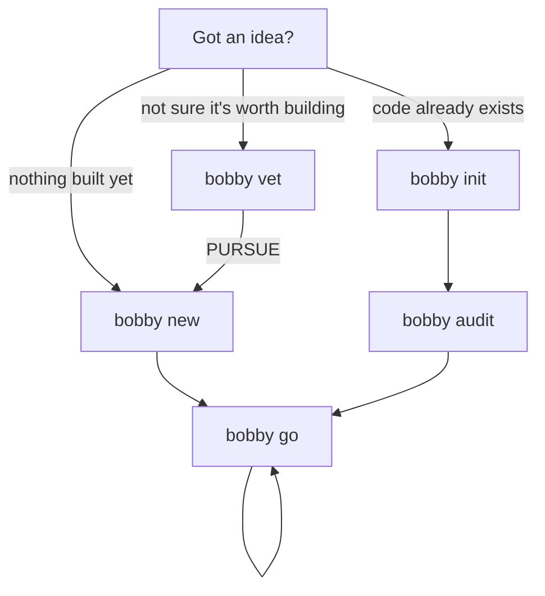

# The Flow — How You Actually Use Bobby

Two doors in, one loop after that.

Everything below is what the CLI does today. If a step here doesn't match what
you see in the terminal, the doc is wrong — file it.

---

## The shape of it



One verb carries the day-to-day: **`bobby go`**. The rest of the surface exists
for when you want to reach past it.

---

## Door 1 — Nothing built yet

```bash
npx bobbycode new "a habit tracker for runners"
```

One command produces a directory that **already runs**:

- A dependency-free skeleton for your stack (`--stack node | web | blog | …`)
- Bobby scaffolded — `.bobby/`, agents, skills, `CLAUDE.md`
- Your idea captured as the MVP epic (TKT-001)
- Git initialized, first commit made

```bash
cd a-habit-tracker-for-runners
npm run dev    # it runs right now → http://localhost:3000
bobby go       # and from here it's one verb
```

**Not sure the idea is worth building?** Vet it first. This works from anywhere,
no project required:

```bash
bobby vet "a habit tracker for runners"
```

It asks the questions a cofounder would — who feels the pain, what they use
today, the riskiest assumption, the cheapest test — one at a time, then gives an
honest **PURSUE / REFINE / PARK** and a sharpened one-liner. If it survives, feed
the sharpened version to `bobby new`.

---

## Door 2 — The code already exists

```bash
cd my-app
npx bobbycode init
```

**Zero questions by default.** It detects your stack, commands, services, and
existing rules, and configures itself from what it finds. Add `--custom` if you
want the wizard instead.

Already initialized? Running `init` again offers two things: **re-scaffold**
(regenerate skills, agents, and commands from your existing config — tickets are
preserved) or **reconfigure** (the full wizard). Take re-scaffold after a
`bobby upgrade`, which updates the CLI itself but doesn't touch files already
written into your project.

### Then find out where you actually stand

```bash
bobby audit
```

A 0–100 production-readiness score, broken down by Security, Reliability,
Operability, and Change safety, with every gap worst-first. It's **deterministic
and local** — no model calls, no network, no token cost — so it's free to run as
often as you like.

```
  ██████████████████████░░  92/100  production-ready
```

Checks that don't apply to your project are skipped, not counted against you.

### Turn the score into work

```bash
bobby pack list                     # what's installed
bobby audit --pack saas-starter     # score against a platform's expectations
bobby pack apply saas-starter       # seed that roadmap as real tickets
bobby go                            # work it
```

---

## The loop — where you live after day one

```bash
bobby go
```

That's the whole daily interface. With no arguments it looks at the board and
runs the most valuable next thing:

| Where the project is | What `go` does |
|---|---|
| Fresh epic, nothing broken down | Plans it into MVP tickets |
| Epic with children | Builds them on one branch |
| Work in flight | Pushes the furthest-along ticket to its next stage |
| Nothing started | Tells you how to kick something off |
| Not in a Bobby project | Points you at `bobby new` |

It takes arguments when you know what you want:

```bash
bobby go "add a health check endpoint"   # creates the ticket AND runs it
bobby go TKT-007                         # runs the workflow on that ticket
```

`go` never orchestrates anything itself — it decides *what* to run and hands off
to `bobby run`. Same path, fewer decisions.

### Just say what you want

Anything that isn't a known command is treated as a request and routed to the
right capability:

```bash
bobby "the login button does nothing when clicked"
bobby "is a Slack standup bot worth building"
```

Inside a Claude Code session it's more direct still — the generated `CLAUDE.md`
teaches Claude Code the same routing, so you talk to it with no `bobby` prefix.

---

## What a ticket goes through

`go` runs a **workflow**: an ordered set of stages, each handled by an agent that
starts fresh rather than reviewing its own work.


Built in, no config needed:

| Workflow | Stages | When |
|---|---|---|
| `default` | plan → build → review → test | Most work |
| `secure` | plan → build → security → review → test | Auth, payments, secrets |
| `quick` | plan → build → test | Small, low-risk changes |
| `design` | research → analyze → mockup → spec → build → check | Visual work |

Bobby picks the fitting one. Override with `--workflow <name>`, or define your
own in `.bobbyrc.yml`.

---

## Picking back up days later

Solo work happens in stolen hours, so nothing depends on you remembering:

```bash
bobby brief     # where you left off, what's blocked, the single next action
bobby go        # …or skip reading and just continue
```

---

## Where things live

```
.bobbyrc.yml          config — stack, commands, health checks, areas
.bobby/tickets/       one directory per ticket, markdown + frontmatter
.bobby/sessions/      session logs (gitignored)
.bobby/design/        design spec, when the design workflow has run
.claude/skills/       the agents' instructions
CLAUDE.md             what Claude Code reads to route your requests
```

Tickets are plain files. Read them, edit them, grep them, commit them.

---

## When to reach past `go`

You don't need these to ship. They're here when you want them.

| Want to… | Command |
|---|---|
| Capture a thought without stopping | `bobby idea "..."` |
| See the board | `bobby ticket list` |
| Run one stage only | `bobby run review TKT-007` |
| Group work into a sprint | `bobby sprint` |
| Learn from what went wrong | `bobby retro` |
| Watch it all in a browser | `bobby dashboard` |
| Commit Bobby's data, or set up a remote | `bobby sync` · `bobby sync --setup --init` |

Full list: `bobby --help`.

---

## The one-screen version

```bash
# new idea, nothing built
bobby vet "the idea"        # optional — is this worth it?
bobby new "the idea"        # scaffolds a running project
bobby go                    # again, and again

# existing codebase
bobby init                  # zero questions
bobby audit                 # where do I actually stand?
bobby go "what you want"    # again, and again
```

Two doors. One loop.
