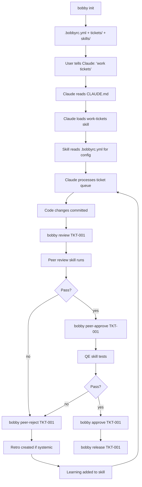

# Bobby — Your Pair Programmer

**Date:** 2026-03-16
**Status:** Design approved, ready for implementation
**Author:** ccevans

---

## Overview

Bobby is an open-source npm CLI that gives structure to AI-assisted development. It provides a structured ticketing system, AI-powered skills, role-based workflows, and a feedback loop (retrospectives + learnings) — packaged for anyone to use.

**Target audience:** People who aren't developers but want to build with Claude. They currently open Claude Code, describe what they want in one big prompt, and hope for the best. Bobby gives them a structured process: ideas become tickets, tickets get plans, plans get built, builds get tested, tested code gets shipped.

**Business model:** Open-source core (free) + pro features gated by Lemonsqueezy license key (subscription). Distribution via npm.

**Why it works:** The value isn't the CLI — a developer could build that in a weekend. The value is the process wisdom baked into the skills: the learnings loop, the retro-to-skill feedback cycle, role separation, verification-before-completion patterns, and TDD discipline. That took months of real-world iteration to develop.

---

## Chosen Approach: Full CLI (Approach B)

Bobby is a global npm CLI. Users run `bobby create`, `bobby list`, `bobby start` — not a bash script. The entire codebase is JavaScript/Node.

**Rationale:**
- Anyone using Claude Code already has Node installed (Claude Code is an npm package)
- One codebase to maintain (no bash/Node split)
- Clean UX: `bobby start TKT-001` everywhere
- Easy to gate pro features with a single `proGuard()` check
- Testable with Jest
- Cross-platform (Windows support without WSL)
- Easy to extend (new commands = new files)

---

## Architecture

### Package Structure

```
bobby/
├── package.json
├── LICENSE                    # MIT
├── README.md
├── bin/
│   └── bobby.js              # CLI entry point (#!/usr/bin/env node)
├── commands/
│   ├── init.js               # Interactive project setup
│   ├── create.js             # Create ticket in backlog
│   ├── idea.js               # Create lightweight idea
│   ├── promote.js            # Promote idea to ticket
│   ├── list.js               # Show board (all or filtered by stage)
│   ├── view.js               # View ticket details
│   ├── plan.js               # View implementation plan
│   ├── files.js              # List ticket folder contents
│   ├── move.js               # Move ticket to any stage
│   ├── assign.js             # Assign ticket
│   ├── comment.js            # Add dev or QE note
│   ├── refine.js             # Shortcut: backlog → refinement
│   ├── ready.js              # Shortcut: refinement → development
│   ├── start.js              # Shortcut: development → in-progress
│   ├── review.js             # Shortcut: in-progress → peer-review
│   ├── peer-approve.js       # Shortcut: peer-review → testing
│   ├── peer-reject.js        # Shortcut: peer-review → needs-rework
│   ├── approve.js            # Shortcut: testing → release
│   ├── reject.js             # Shortcut: testing → needs-rework
│   ├── release.js            # Shortcut: release → released
│   ├── reopen.js             # Shortcut: needs-rework → in-progress
│   ├── block.js              # Shortcut: any → blocked
│   ├── unblock.js            # Shortcut: blocked → backlog
│   ├── retro.js              # Create retrospective
│   ├── learn.js              # Add learning to a skill
│   ├── activate.js           # Save license key
│   ├── dashboard.js          # PRO: terminal board dashboard
│   ├── velocity.js           # PRO: ticket throughput metrics
│   ├── report.js             # PRO: weekly shipped summary
│   └── skills.js             # PRO: install/update skill packs
├── lib/
│   ├── config.js             # Read/write .bobbyrc.yml
│   ├── tickets.js            # Core ticket operations (find, move, create)
│   ├── stages.js             # Stage definitions and validation
│   ├── template.js           # Ticket template rendering
│   ├── counter.js            # Auto-incrementing ID management
│   ├── colors.js             # Terminal color helpers
│   ├── license.js            # Lemonsqueezy key validation
│   └── proGuard.js           # Gates pro commands
├── templates/
│   ├── CLAUDE.md.ejs         # Project CLAUDE.md (templated)
│   ├── WORKFLOW.md.ejs       # Workflow documentation (templated)
│   ├── ticket.md.ejs         # Ticket template (templated)
│   ├── test-cases.md         # Starter test cases file
│   ├── learnings.md          # Starter learnings file
│   └── skills/
│       ├── work-tickets/
│       │   ├── SKILL.md.ejs
│       │   └── learnings.md
│       ├── qe/
│       │   ├── SKILL.md.ejs
│       │   └── learnings.md
│       ├── peer-review/
│       │   ├── SKILL.md.ejs
│       │   └── learnings.md
│       ├── refine-tickets/
│       │   ├── SKILL.md.ejs
│       │   └── learnings.md
│       ├── release-tickets/
│       │   ├── SKILL.md.ejs
│       │   └── learnings.md
│       └── ideate/
│           ├── SKILL.md.ejs
│           └── learnings.md
├── stacks/
│   ├── nextjs.json           # Next.js defaults (areas, health checks, commands)
│   ├── rails-react.json      # Rails + React defaults
│   ├── python-flask.json     # Python/Flask defaults
│   ├── generic.json          # Fallback defaults
│   └── _schema.json          # Stack config schema
└── test/
    ├── commands/
    │   ├── init.test.js
    │   ├── create.test.js
    │   ├── move.test.js
    │   └── ...
    └── lib/
        ├── tickets.test.js
        ├── config.test.js
        └── ...
```

### Config File: `.bobbyrc.yml`

Created by `bobby init` in the project root:

```yaml
project: my-saas-app
stack: nextjs

# Where tickets live (relative to project root)
tickets_dir: tickets

# Dev environment health checks
health_checks:
  - name: app
    url: http://localhost:3000
    description: "Next.js app"

# Feature areas for ticket classification
areas:
  - auth
  - dashboard
  - billing
  - api
  - public-pages

# Area → skill mapping (auto-populated from stack)
skill_routing:
  auth: ["dev/fullstack"]
  dashboard: ["dev/frontend"]
  billing: ["dev/fullstack"]
  api: ["dev/backend"]
  public-pages: ["dev/frontend"]

# Ticket prefix (default: TKT)
ticket_prefix: TKT

# Idea prefix (default: IDEA)
idea_prefix: IDEA

# License key is stored globally in ~/.bobby/license (not in project config)
# Run: bobby activate <key>
```

### Stack Configs

Each stack JSON pre-populates sensible defaults. Example `nextjs.json`:

```json
{
  "name": "nextjs",
  "display": "Next.js",
  "health_checks": [
    { "name": "app", "url": "http://localhost:3000", "description": "Next.js dev server" }
  ],
  "areas": ["auth", "dashboard", "api", "public-pages", "billing"],
  "skill_routing": {
    "auth": ["dev/fullstack"],
    "dashboard": ["dev/frontend"],
    "api": ["dev/backend"],
    "public-pages": ["dev/frontend"],
    "billing": ["dev/fullstack"]
  },
  "commands": {
    "dev": "npm run dev",
    "test": "npm test",
    "lint": "npm run lint",
    "build": "npm run build"
  },
  "template_vars": {
    "test_command": "npm test",
    "lint_command": "npm run lint",
    "spec_dir": "__tests__/"
  }
}
```

---

## Init Flow

```
$ npx bobby init

  Welcome to Bobby — your pair programmer.

  Project name: My SaaS App
  Stack: (use arrow keys)
  ❯ Next.js
    Rails + React
    Python / Flask
    Other (I'll configure manually)

  Dev server URL (default: http://localhost:3000):

  ✓ Created tickets/ with 10 lifecycle stages
  ✓ Created .bobbyrc.yml
  ✓ Created .claude/skills/ with 6 workflow skills
  ✓ Created CLAUDE.md with Bobby workflow instructions
  ✓ Created tickets/WORKFLOW.md

  You're ready! Here's how to get started:

    bobby idea "my first feature"     # Capture an idea
    bobby create -t "Build login"     # Create a ticket
    bobby list                        # See your board

  Tell Claude: "work tickets" and it'll pick up from the queue.
```

### What `bobby init` generates in the user's project:

```
project-root/
├── .bobbyrc.yml                    # Bobby config
├── CLAUDE.md                       # Instructions for Claude (roles, workflow, health checks)
├── .claude/
│   └── skills/
│       ├── work-tickets/
│       │   ├── SKILL.md
│       │   └── learnings.md
│       ├── qe/
│       │   ├── SKILL.md
│       │   └── learnings.md
│       ├── peer-review/
│       │   ├── SKILL.md
│       │   └── learnings.md
│       ├── refine-tickets/
│       │   ├── SKILL.md
│       │   └── learnings.md
│       ├── release-tickets/
│       │   ├── SKILL.md
│       │   └── learnings.md
│       └── ideate/
│           ├── SKILL.md
│           └── learnings.md
└── tickets/
    ├── .template.md
    ├── .counter
    ├── .idea-counter
    ├── WORKFLOW.md
    ├── README.md
    ├── 0-ideas/
    ├── 1-backlog/
    ├── 2-ready-for-refinement/
    ├── 3-ready-for-development/
    ├── 4-in-progress/
    ├── 5-peer-review/
    ├── 6-ready-for-testing/
    ├── 7-ready-for-release/
    ├── 8-needs-rework/
    ├── 9-blocked/
    ├── 10-released/
    ├── retrospectives/
    └── docs/
```

---

## Genericization: What Bobby Makes Configurable

### CLI commands (replacing shell scripts)

| Hardcoded approach | Bobby (configurable) |
|----------------------|---------------------|
| Hardcoded area lists | Read from `.bobbyrc.yml` `areas` field |
| Skills in a fixed project path | Skills live in `.claude/skills/` within the project |
| Hardcoded health check URLs | Read from `.bobbyrc.yml` `health_checks` array |
| Assumed tech stack | Read from `.bobbyrc.yml` `stack` field |
| Assumed sub-repo layout | Not assumed — single repo by default, configurable via `repos` |
| Hardcoded skill-area mapping | Read from `.bobbyrc.yml` `skill_routing` |
| Hardcoded `sed` commands | Node `fs` operations (cross-platform) |
| Hardcoded test runner | Read from stack config `commands.test` |
| Fixed ticket prefix | Configurable via `ticket_prefix` |

### Skills: What Gets Genericized

Each skill template (`.ejs`) replaces hardcoded values with config lookups:

| Hardcoded approach | Replaced with |
|-------------------------------|---------------|
| Hardcoded health check URLs | Loop over `health_checks` array — render a check block per entry |
| Hardcoded dev server commands | `<%= commands.dev %>` |
| Hardcoded test commands | `<%= commands.test %>` |
| Hardcoded test commands (per-repo) | `<%= commands.test %>` (single repo) or per-repo commands if `repos` config exists |
| Hardcoded lint commands | `<%= commands.lint %>` |
| Fixed skill path | `.claude/skills/{path}/SKILL.md` (or target-specific path) |
| Fixed area list | `<%= areas.join(' \| ') %>` |

### Skills: What Stays the Same

The process logic is the crown jewel and doesn't change:

- Ticket queue processing loop (priority ordering, area continuity)
- TDD red-green-refactor cycle in work-tickets
- Systematic debugging for bug tickets
- Verification-before-completion (evidence, then assertion)
- Retrospective → learning → skill feedback loop
- Peer review structured checklist
- QE browser-based testing methodology
- Ideation flow (brainstorm → approaches → spec → tickets)
- Learnings files that accumulate over time

---

## Free vs Pro Features

### Free (open source)

Everything needed to run the full workflow:

- `bobby init` — project setup
- All ticket commands: `create`, `list`, `view`, `move`, `start`, `review`, `approve`, `reject`, `block`, `reopen`, `release`
- All shortcut commands: `refine`, `ready`, `peer-approve`, `peer-reject`
- Ideas: `idea`, `promote` (`bobby list 0-ideas` shows all ideas)
- Notes: `comment`, `assign`
- Retrospectives: `retro`, `learn`
- Plans: `plan`, `files`
- 6 workflow skills (work-tickets, qe, peer-review, refine-tickets, release-tickets, ideate)
- Stack templates (nextjs, rails-react, python-flask, generic)
- Full CLAUDE.md and WORKFLOW.md generation

### Pro ($19/mo via Lemonsqueezy)

Power features for heavy users:

- `bobby dashboard` — terminal UI showing tickets per stage with real-time counts
- `bobby velocity` — throughput metrics (tickets/week, avg cycle time, time in each stage)
- `bobby report` — auto-generated weekly summary of what shipped
- `bobby skills install <pack>` — install premium skill packs from registry
- `bobby skills update` — update all installed skills to latest versions
- Premium skill packs (sold separately or bundled):
  - Industry-specific skills (SaaS, e-commerce, mobile)
  - Advanced QE skill with visual regression testing
  - Multi-repo release skill
  - Advanced ideation with market analysis

### License Key Flow

```
$ bobby activate sk_live_abc123def456

  ✓ License validated
  ✓ Saved to ~/.bobby/license
  ✓ Pro features unlocked

$ bobby dashboard   # Now works

$ bobby velocity    # Now works
```

License key is stored in `~/.bobby/license` (global, not per-project). Validation hits Lemonsqueezy API on first use, then caches for 24 hours. **Offline behavior:** if the cache has expired and the user is offline, pro features remain unlocked using the last cached validation. The cache only hard-expires after 7 days offline — this prevents punishing users with flaky internet.

```javascript
// lib/proGuard.js
const PRO_COMMANDS = ['dashboard', 'velocity', 'report', 'skills'];

class LicenseError extends Error {
  constructor(message) { super(message); this.name = 'LicenseError'; }
}

async function proGuard(cmd) {
  if (!PRO_COMMANDS.includes(cmd)) return true;
  const key = readLicenseKey();
  if (!key) {
    throw new LicenseError('Pro feature. Get a license at bobby.dev\nThen run: bobby activate <key>');
  }
  if (!await validateKey(key)) {
    throw new LicenseError('License expired or invalid. Renew at bobby.dev');
  }
  return true;
}
```

---

## Data Flow



---

## Error Handling

- `bobby *` run outside a Bobby project (no `.bobbyrc.yml`) → "Not a Bobby project. Run `bobby init` first."
- `bobby create` with no title → "Title is required. Usage: bobby create -t 'Title'"
- `bobby start TKT-999` (not found) → "Ticket TKT-999 not found"
- `bobby move TKT-001 invalid-stage` → "Invalid stage 'invalid-stage'. Valid stages: ..."
- `bobby dashboard` without license → "Pro feature. Get a license at bobby.dev"
- Corrupted `.counter` file → auto-repair by scanning existing ticket folders for max ID
- `bobby init` in an already-initialized project → detect `.bobbyrc.yml`, prompt: "Bobby is already set up. Re-initialize? This will overwrite config and regenerate skills. Tickets are preserved. (y/N)". Tickets directory is never wiped — only config and skill files are regenerated.
- `bobby` with no args → show help (same as `bobby --help`)
- `bobby --version` → read from package.json. `bobby --help` → commander auto-generated help.

---

## Testing Strategy

- Unit tests for all `lib/` modules (config parsing, ticket operations, template rendering)
- Integration tests for each command (create temp dir, run init, verify output)
- Snapshot tests for generated files (ensure templates render correctly per stack)
- E2E test: init → create → start → review → approve → release full lifecycle

---

## Out of Scope (v1)

- Simplified "beginner mode" with fewer stages
- Multi-agent coordination / lock files
- Slack/Discord integrations
- Web dashboard
- Skill marketplace / registry (pro skills are just additional npm packages for now)
- `bobby update` to update skills in an existing project (v1: re-run `bobby init`)
- Windows-specific testing (Node handles cross-platform, but no CI for Windows in v1)

---

## Implementation Order

1. **Scaffold the npm package** — package.json, bin entry, commander.js CLI framework
2. **Port core ticket operations** — `lib/tickets.js`, `lib/stages.js`, `lib/counter.js`, `lib/template.js`
3. **Build `bobby init`** — interactive prompts, config generation, file scaffolding
4. **Port all ticket commands** — create, list, view, move, + all shortcuts
5. **Build template rendering** — .ejs templates for CLAUDE.md, WORKFLOW.md, skills
6. **Port ideas, retros, learnings** — idea, promote, retro, learn commands
7. **Add license gating** — `lib/license.js`, `lib/proGuard.js`, `bobby activate`
8. **Build pro commands** — dashboard, velocity, report (can be stubs initially)
9. **Write tests** — unit + integration for all commands
10. **Polish** — README with demo gif, npm publish, Lemonsqueezy product setup

---

## Key Dependencies

| Package | Purpose |
|---------|---------|
| `commander` | CLI argument parsing |
| `inquirer` | Interactive prompts (init) |
| `ejs` | Template rendering |
| `chalk` | Terminal colors |
| `yaml` | .bobbyrc.yml parsing |
| `node-fetch` | Lemonsqueezy API calls (license validation) |

All lightweight, well-maintained, zero native dependencies.

---

## Name & Branding

- **Name:** Bobby
- **Tagline:** "Your pair programmer"
- **npm package:** `bobbycode` (confirmed available 2026-03-16)
- **Domain:** bobby.dev (check availability)
- **GitHub:** github.com/ccevans/bobby (or dedicated org)

**Package name locked:** `bobbycode` on npm. CLI command is `bobby`.
